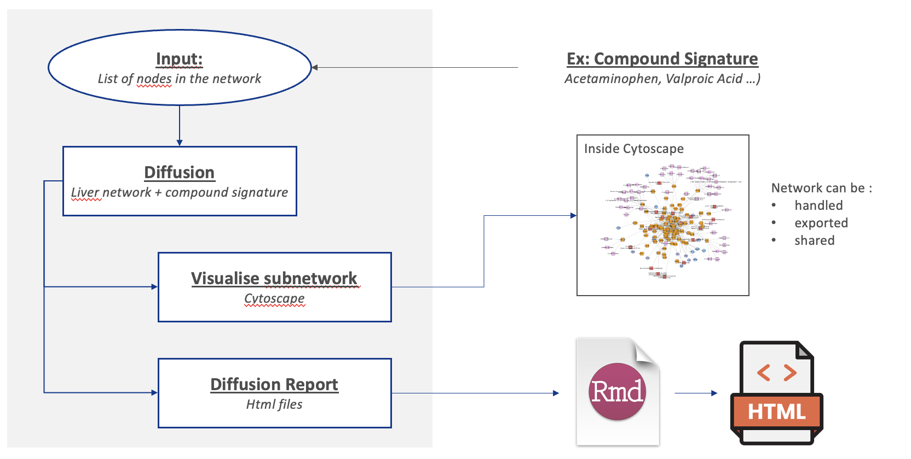
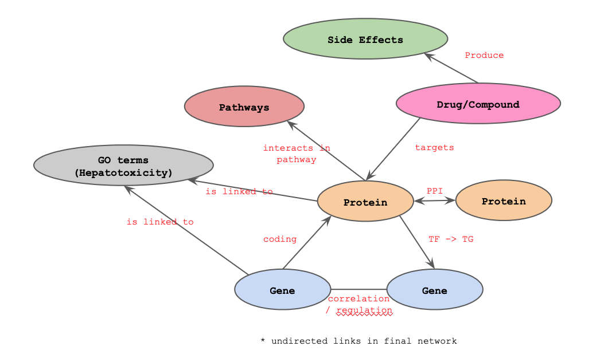

# CENetwork: Network exploration

This package provides a multi-omics network and allows diffusion analysis from a gene list of nodes.

The main diffusion method is based on the Random Walk with Restart principle on a multi-layer network.
We have modified the algorithm to force the passage through distant layers of the network (user defined parameter).

From each element of a list of nodes (seeds), we calculate the RWR scores, and then identify the closest targets for each of the selected layers. Finally, we extract the shortest paths between the seed and these targets and return a sub-network with the intermediate nodes.

This subnetwork is exportable to Cytoscape.

To help the interpretation, we build automated reports to highlight notable features (high connected nodes with hepatotoxic functions, distance drug - gene signature, distance pathways signature, ...)

## Typical Workflow

Here is the typical workflow:
From a drug gene signature (differential expressed genes with a given drug against control samples), the user can produce the diffusion subnetwork `get_route()`, then export this to Cytoscape `export_to_cytoscape()` and generate html report to assist the interpretation of the network (`report()` to generate information tables and `produce_diffusion_report()` to build html files.).




## Informations about the network(s)

Currently, we build a liver specific network to evaluate the toxicity of a given drug/compound.
However, we plan to include more organ specific networks to evaluate other aspects of drugs.

### Liver Network v1



The Liver network is composed of 6 layers. 
The layer are connected to each other based on the above figure.
The layer compositions is described in the table below.

| Layer|  Nb. nodes|
|:-------------|-----:|
|gene          |  4400|
|protein       | 12898|
|drug/compound |  2114|
|pathway       |  2014|
|side effect   |   147|
|GO            |    58|

## Install

### Latest `GitHub` Version

Install the devtools package in R, then load it and install the latest stable version of from `GitHub`

```r 
## install devtools if not installed
if (!requireNamespace("devtools", quietly = TRUE))
    install.packages("devtools")

# install the package (last version)
devtools::install_github("abodein/CENetwork")

# load the package
library(CENetwork)
```

### Install Cytoscape

Install the latest version of Cytoscape: https://cytoscape.org/download.html

Cytoscape must be open during the exportation process.
Please check your connection via

```r
RCy3::cytoscapePing()
```


## Maintainer
Antoine Bodein (<bodein.antoine@gmail.com>)

## Bugs/Feature requests

If you have any bugs or feature requests, [let us know](https://github.com/abodein/CENetwork/issues). Thanks!
