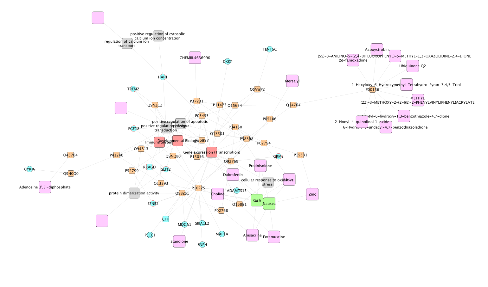

```{r setup, echo = FALSE, warning=FALSE, message=FALSE}
knitr::opts_chunk$set(fig.align = "center", message = FALSE, warning = FALSE)
library(tidyverse)
library(igraph)
```

# Introduction

You are about to explore a multi-layered network specific to the liver using diffusion algorithm.

For this, you will need a list of molecules of interest as an entry point to the network.
From this list, this tool offers to navigate through the layers and extract one subnetwork based on the overall network topology.

The subnetwork is exportable to Cytoscape and can be further handled for a better interpretation.
Alongside the subnetwork, we also produce a report of notable features from this result.

In this manual, we detail the characteristics of the global liver network and guide you to produce sub-networks specific to the list of molecules of interest.

# Prerequisite

## Install and load the package

```{r install, eval = FALSE}
# install devtools
install.packages("devtools")
# install the package (last version)
devtools::install_github("abodein/CENetwork")
```


```{r load, eval = TRUE}
# load the package
library(CENetwork)
```

## Install Cytoscape

Install the latest version of Cytoscape: https://cytoscape.org/download.html

Cytoscape must be open during the exportation process.
Please check your connection via

```{r, eval = FALSE, echo=TRUE}
# return an error if Cytoscape can not be found
RCy3::cytoscapePing()
```

# A word about the liver network

The liver network is composed of 6 layers (gene, protein, drug/compound, pathway, side effect and Hepatox GO terms).

First, the protein-protein interaction network layout wos build based on BioGRID (https://thebiogrid.org) and only proteins expressed in liver were kept (https://www.proteinatlas.org/humanproteome/tissue/liver).

Proteins were connected to an in-house gene coregulation network (ARACNE https://bmcbioinformatics.biomedcentral.com/articles/10.1186/1471-2105-7-S1-S7) with gene to protein coding information and Transctipted Factor (TF) to Targeted Genes (TG) with TF2DNA (https://www.fiserlab.org/tf2dna_db/), TRRUST https://www.grnpedia.org/trrust/ and Dorothea (https://saezlab.github.io/dorothea/). Only interactions between the present genes and proteins were included.

Drugs were extracted from DrugBank and were linked to their protein targets (https://drugbank.ca).
We used CHEMBL to add IC50 information when available for the HepG2 cell line and if the compound and its targets were present in the network.
Side Effects were extracted from SIDER and were linked to drugs (http://sideeffects.embl.de).

Proteins were also linked to Reactome pathways (https://reactome.org).

Finaly, GO terms linked to hepato-toxicicity were connected to gene and protein.
We took the list of GO terms from: 

De Abrew KN, Overmann GJ, Adams RL, Tiesman JP, Dunavent J, Shan YK, Carr GJ, Daston GP, Naciff JM. A novel transcriptomics based in vitro method to compare and predict hepatotoxicity based on mode of action. Toxicology. 2015 Feb 3;328:29-39. doi: 10.1016/j.tox.2014.11.008. Epub 2014 Dec 2. PMID: 25475144.
Tripodi IJ, Callahan TJ, Westfall JT, Meitzer NS, Dowell RD, Hunter LE. Applying knowledge-driven mechanistic inference to toxicogenomics. Toxicol In Vitro. 2020 Aug;66:104877. doi: 10.1016/j.tiv.2020.104877. Epub 2020 May 6. PMID: 32387679; PMCID: PMC7306473.


Schematic figure of v1 liver network

## Global network statistics

The overall network is composed of 24,103 nodes spread over 6 layers: 4400 genes, 12898 proteins, 2114 drugs/compounds, 2014 pathways, 262 side effects and 58 Hepatox GO terms.

The nodes are linked to each other with 637,663 interactions which represent gene-protein coding, PPI, TF-TG, drug-target, acts-in-pathway, ...


## Vertex Attributes

Each node has attributes. Here is the complete list of attributes of this current version of the global network. Some attributes are shared between all the nodes and some are specific to the type of node. 

Shared attributes:

- name : node id
- display_name : displayed name in Cytoscape
- type : layer, type of mmolecule/node
- link : URL to specific database node page

Gene nodes:

- SYMBOL : Symbol ID
- ENSEMBL : Ensembl ID
- TG : is a targeted gene from a Transcription Factor
- gene_hepatox_Toxicology2014 : connected to GO terms in the list Toxicology2014
- gene_hepatox_ToxicologyInVitro2020 : connected to GO terms in the list ToxicologyInVitro2020
- gene_hepatox : both list 

Protein nodes:

- UNIPROT : Uniprot ID
- TF : is a Transcription Factor
- protein_name : name of the protein
- HPA_liver_specific : human proteome athal, protein is expressed in liver specificaly
- protein_hepatox_Toxicology2014 : connected to GO terms in the list Toxicology2014
- protein_hepatox_ToxicologyInVitro2020 : connected to GO terms in the list ToxicologyInVitro2020
- protein_hepatox : both list


Drug/Compound nodes :

- drugbank_id : DrugBank ID
- chembl_id : Chembl ID
- drug_name : Drug common name
- IC50 : all IC50 for a drug and its targets in the format DRUG_TARGET_VALUE;...
- Molecule.Max.Phase : Clinical Phase
- DILI_severity_class : DILI severity score
- vDILIConcern : DILI concern class 
- drug_has_side_effect : TRUE = drug is connected to a SIDER effect

Pathway nodes :

- pathway_name : Pathway name
- pathway_database : name of database
- pathway_id : Pathway ID

GO nodes :

- go_d
- go_ontology
- go_term_name

# What this package do: a typical workflow

Here is the typical diffusion workflow: 1) get diffusion results from a list of seeds.
Then, 2) export the resulting subnetwork to cytoscape and 3) produce a report to highlight valuable nodes on the network.


# Example: Acetaminophen

Here we illustrate the diffusion with a quick example.
We difined a custom gene signature from the drug Acetaminophen

First, let's load the data :
```{r load_data}
data(liver_1.3_network)  # the network
data(liver_1.3_rwr_closest_dfr) # pre-calculated diffusion scores
data("signature_maison") # custom gene signature
signature_acetaminophen <- signature_maison$`acetaminophen_all_all`
signature_acetaminophen
```

## Get diffusion 

We use the function `get_route()` for the diffusion and we provide the liver network and the seeds to start from.
We can chose to reach the drug/compound pathway and side effect layers.
The detailed description of the function is available with `?get_route`.

```{r getroute}
# load data RWR scores
diffusion.res <- get_route(network = liver_1.3_network, # the network
            closest_dfr = liver_1.3_rwr_closest_dfr, # pre-calculated diffusion scores
            signature_vids = signature_acetaminophen, # input seeds
            target_type = c("drug/compound", "pathway", "side_effect")) # layers to reached
```

## Export to Cytoscape

With Cytoscape open, we can export the resulting subnetwork to Cytoscape and apply a custom theme.
In this theme we decided to colorized the node based on the `type` attribute and few other ajustments (`?apply_custom_theme`).

```{r cyto, eval = FALSE}
# export to cytoscape
export_to_cytoscape(diffusion.res)
apply_custom_theme()
```



## Report

First, we build the different table shown in the report, then we produce the html file.
In the report, the tables describe:

- degree_signature: degree of input nodes and hepatox infos
- drugs: drug infos with DILI score, IC50
- drugs.targets: drug to protein target
- drugs.side_effect: drug side effects
- drug.dist.signature: closest input node(s) for each drug and their distance
- pathways: pathway infos
- pathways.dist.signature: closest input node(s) for each pathway and their distance
- GOs: GO infos
- GO.dist.signature: closest input node(s) for each GO and their distance

```{r report, eval = FALSE}
# generate report
diffusion.report <- report(diffusion.res) # result from get_route()

# produce the table
produce_diffusion_report(res_report = diffusion.report, # result from report()
                         report_title = "Acetaminophen", 
                         report_out_filepath = "Acetaminophen_report.Rmd", # Rmd file
                         overwrite = TRUE, # overwrite report_out_filepath
                         render = TRUE) # produce html
```

