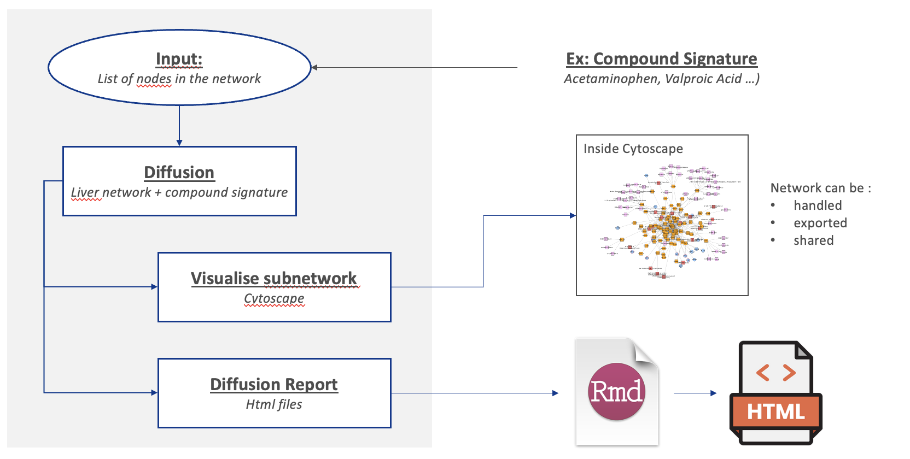
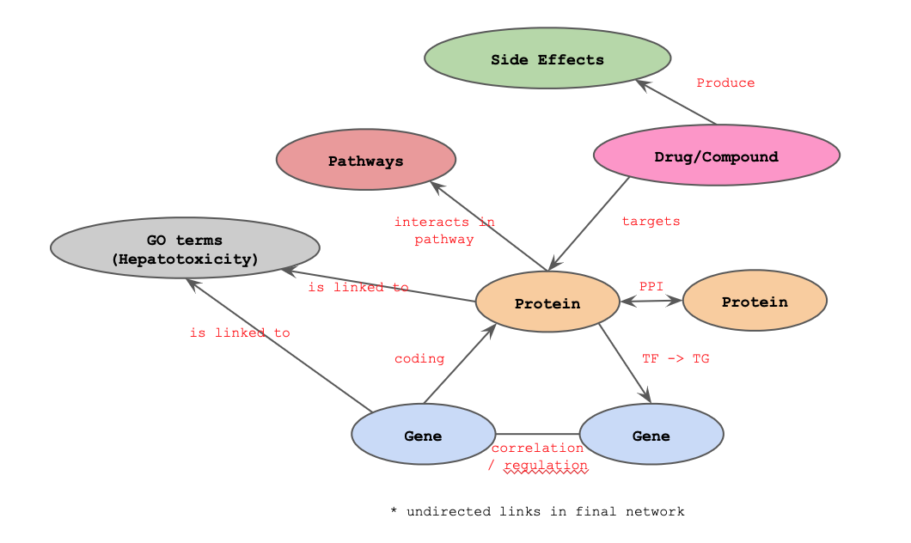
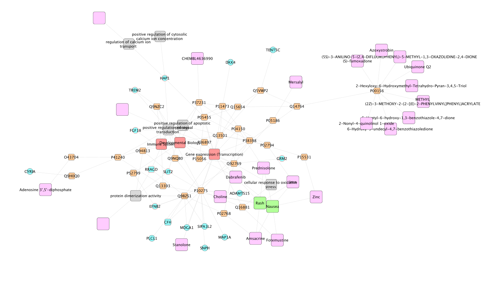

```{r setup, echo = FALSE, warning=FALSE, message=FALSE}
knitr::opts_chunk$set(fig.align = "center", message = FALSE, warning = FALSE)
library(tidyverse)
library(igraph)
library(CENetwork)
```

# Introduction

CENetwork enables biological signal diffusion over a multi-layer liver network.
Starting from a list of seed molecules (genes, proteins, or drugs), the package
traces shortest paths through the network layers and extracts a biologically
meaningful subnetwork.

The workflow covers four steps:

1. **Diffusion** — `get_route()` builds the subnetwork from seed molecules.
2. **Enrichment** — `compute_diffusion_enrichment()` identifies significantly
   visited nodes using permutation-based z-scores.
3. **Export** — `export_to_cytoscape()` sends the subnetwork to Cytoscape for
   visual exploration.
4. **Dashboard** — `produce_quarto_dashboard()` generates an interactive HTML
   dashboard summarising all results.



# Prerequisite

## Install and load the package

```{r install, eval = FALSE}
install.packages("devtools")
devtools::install_github("abodein/CENetwork")
```

```{r load, eval = FALSE}
library(CENetwork)
```

## Install Cytoscape (optional, for export)

Download the latest version from <https://cytoscape.org/download.html>.
Cytoscape must be running before calling `export_to_cytoscape()`.

```{r cytoping, eval = FALSE}
RCy3::cytoscapePing()   # returns an error if Cytoscape is unreachable
```

# The liver network

The liver network is composed of **6 layers**: gene, protein, drug/compound,
pathway, side effect, and hepatotoxicity GO terms (~24 000 nodes,
~637 000 interactions).

Key data sources: BioGRID (PPI), Human Protein Atlas (liver expression),
DrugBank (drug–target), SIDER (side effects), FDA LTKB (DILI scores),
Reactome (pathways), and two hepatotoxicity GO term lists
(Toxicology 2014; ToxicologyInVitro 2020).



# Basic diffusion

## Load data

```{r load_data}
data(liver_1.7_network)
data(liver_1.7_rwr_closest_dfr)
data(signature_maison)

# Gene signature for acetaminophen (APAP)
signature_acetaminophen <- signature_maison$`acetaminophen_all_all`
head(signature_acetaminophen)
```

## Run diffusion

`get_route()` filters the pre-calculated diffusion table (`closest_dfr`) to the
seeds of interest and assembles all shortest paths into a subnetwork.

```{r getroute}
diffusion_apap <- get_route(
  network        = liver_1.7_network,
  closest_dfr    = liver_1.7_rwr_closest_dfr,
  signature_vids = signature_acetaminophen,
  target_type    = c("drug/compound", "pathway", "side_effect")
)

# Quick summary
igraph::vcount(diffusion_apap$network)   # number of nodes
igraph::ecount(diffusion_apap$network)   # number of edges
```

## Mandatory nodes

Use `mandatory_nodes` to pin specific seeds that must always appear in the
subnetwork — for example, to anchor the diffusion on a known drug node.
These nodes are added to `signature_vids` before filtering.

```{r mandatory}
# Force the acetaminophen DrugBank node (DB00316) into the route
diffusion_apap_anchored <- get_route(
  network         = liver_1.7_network,
  closest_dfr     = liver_1.7_rwr_closest_dfr,
  signature_vids  = signature_acetaminophen,
  target_type     = c("drug/compound", "pathway", "side_effect"),
  mandatory_nodes = "DB00316"
)
```

# Permutation analysis

## Principle

A permutation test assesses whether the nodes found in the subnetwork are
specifically enriched by the real signature or simply reflect network topology
(hub effects).

For each of the `n_permut` iterations, a random gene signature of the same size
is drawn and the same diffusion is performed.  The **visit count** of a node is
the number of seed→target shortest paths that pass through it.  A null
distribution is built from the permuted visit counts, and a z-score is computed:

$$z_v = \frac{c_v^{obs} - \bar{c}_v^{perm}}{\sigma_v^{perm}}$$

A one-sided p-value is derived from a normal approximation:
$p_v = 1 - \Phi(z_v)$.

When `mandatory_nodes` are specified they are **fixed** across all permutations
— only the gene part is randomised — ensuring a fair comparison.

## Running with permutations

```{r permut}
diffusion_apap_permut <- get_route(
  network         = liver_1.7_network,
  closest_dfr     = liver_1.7_rwr_closest_dfr,
  signature_vids  = signature_maison$`acetaminophen_all_all`,
  target_type     = c("drug/compound", "pathway", "GO", "side_effect"),
  mandatory_nodes = "DB00316",
  do_permutation  = TRUE,
  n_permut        = 100,
  seed_permut     = 123
)

# visit_count and z_score are stored as vertex attributes
head(igraph::vertex_attr(diffusion_apap_permut$network, "z_score"))
```

## Enrichment statistics

`compute_diffusion_enrichment()` filters to the target layers of interest
(GO terms, pathways, …), builds the permutation matrix, and returns a ranked
table with z-scores, p-values, and BH-adjusted p-values.

```{r enrichment}
enrich_apap <- compute_diffusion_enrichment(
  route_result    = diffusion_apap_permut,
  target_types    = c("GO", "pathway"),
  min_visit_count = 1L,
  padj_method     = "BH"
)

# Significant GO terms
go_apap <- enrich_apap[enrich_apap$type == "GO" & enrich_apap$padj < 0.05, ]
head(go_apap[, c("label", "visit_count", "z_score", "padj")])
```

# Use case: Acetaminophen vs Valproic acid

The following example runs the full pipeline for two hepatotoxic drugs and
compares their enriched GO terms.

```{r usecase, eval = FALSE}
data(liver_1.7_network)
data(liver_1.7_rwr_closest_dfr)
data(signature_maison)

target_layers <- c("side_effect", "GO", "drug/compound", "pathway")

# --- Acetaminophen (APAP) ---------------------------------------------------
sig_apap <- signature_maison$`acetaminophen_all_all`

res_apap <- get_route(
  network         = liver_1.7_network,
  closest_dfr     = liver_1.7_rwr_closest_dfr,
  signature_vids  = sig_apap,
  target_type     = target_layers,
  mandatory_nodes = "DB00316",
  do_permutation  = TRUE,
  n_permut        = 100,
  seed_permut     = 123
)

enrich_apap <- compute_diffusion_enrichment(res_apap,
                                            target_types = c("GO", "pathway"))

# --- Valproic acid (VPA) ----------------------------------------------------
sig_vpa <- signature_maison$`valproic acid_all_all`

res_vpa <- get_route(
  network         = liver_1.7_network,
  closest_dfr     = liver_1.7_rwr_closest_dfr,
  signature_vids  = sig_vpa,
  target_type     = target_layers,
  mandatory_nodes = "DB00313",
  do_permutation  = TRUE,
  n_permut        = 100,
  seed_permut     = 123
)

enrich_vpa <- compute_diffusion_enrichment(res_vpa,
                                           target_types = c("GO", "pathway"))

# --- Compare GO terms -------------------------------------------------------
go_apap <- enrich_apap[enrich_apap$type == "GO", c("term", "label", "z_score", "padj")]
go_vpa  <- enrich_vpa [enrich_vpa$type  == "GO", c("term", "label", "z_score", "padj")]

shared <- intersect(
  go_apap$term[go_apap$padj < 0.05],
  go_vpa$term [go_vpa$padj  < 0.05]
)
cat("GO terms significant in both drugs:", length(shared), "\n")
```


# Dashboard

`produce_quarto_dashboard()` generates a self-contained interactive Quarto
dashboard (`.qmd` → HTML) that brings together the subnetwork summary, drug
table, pathway and GO enrichment results, and the ORA radar plots.

```{r dashboard, eval = FALSE}
res_report_apap <- report(res_apap, complete_network = liver_1.7_network)

produce_quarto_dashboard(
  res_report       = res_report_apap,
  res_diffusion    = res_apap,
  complete_network = liver_1.7_network,
  title            = "Acetaminophen – liver network diffusion",
  output_filepath  = "dashboard_apap.qmd",
  se_to_severity   = se_to_severity,
  render           = TRUE,
  overwrite        = TRUE
)
```

The dashboard provides:

- **Network summary** — node count per layer, degree distribution of input seeds
- **Drugs** — DILI scores, targets, side effects
- **Pathways & GO terms** — enrichment table with z-score, p-value, padj
- **Most visited nodes** — ranked by visit count
- **ORA radar** — over-representation of hepatotoxicity-linked node sets


# Export to Cytoscape

```{r cyto, eval = FALSE}
export_to_cytoscape(res_apap)
apply_custom_theme()
```



# Session info

```{r sessioninfo}
sessionInfo()
```
